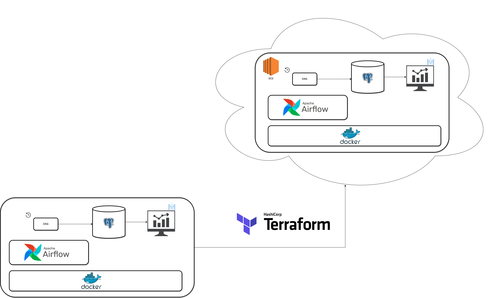

**E-commerce Customer Data Platform**

This project (under construction) consumes raw data and creates a data warehouse using STAR SCHEMA and a Dashboard.

Tools: Airflow, Postgres, SQL, Python, Terraform, AWS, Docker, Metabase, Github Actions.

Thanks @josephmachado for the Airflow template.

**Data infrastructure**
